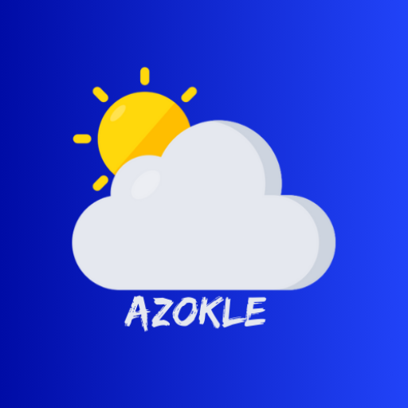
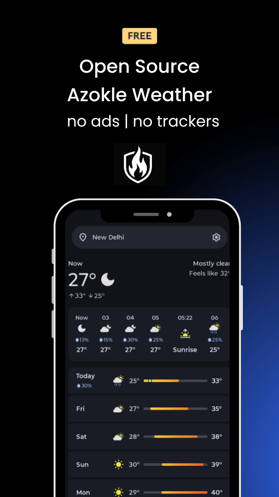
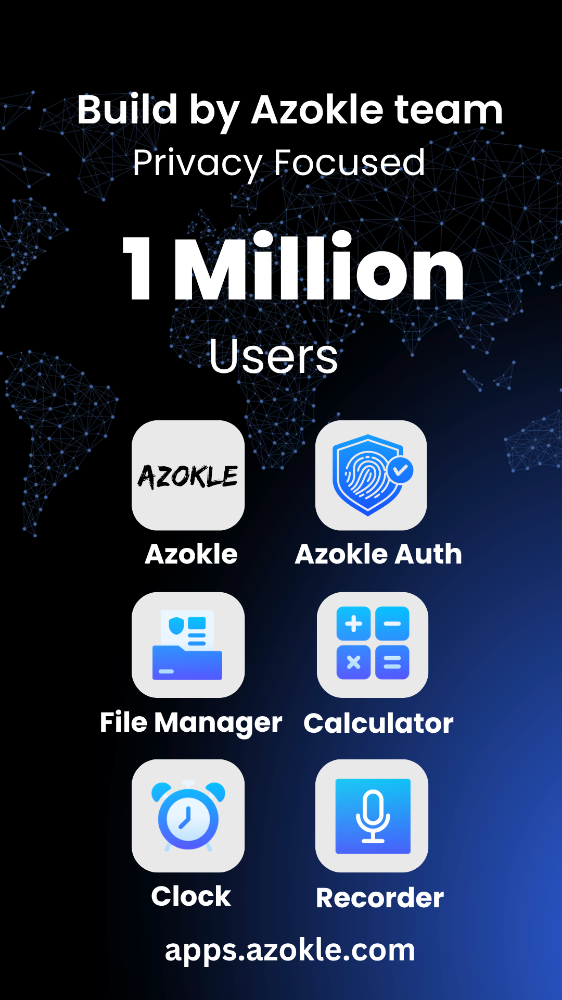
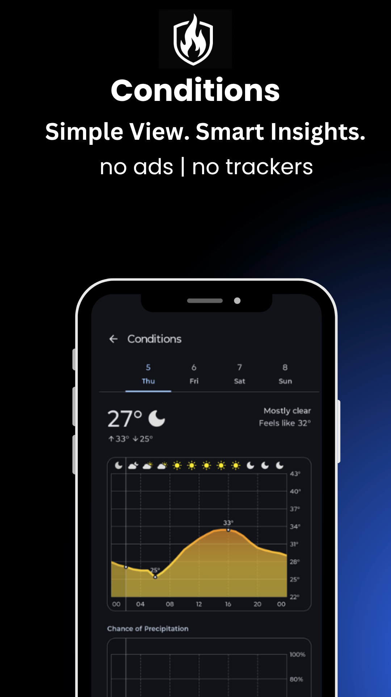
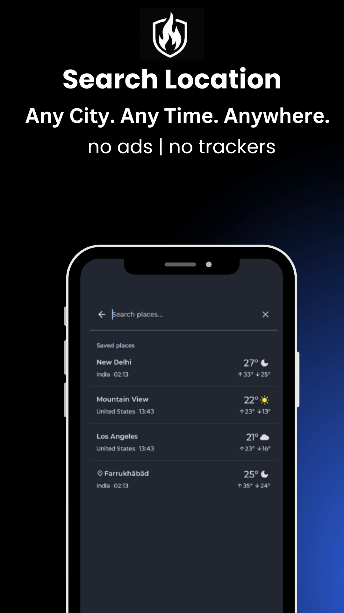

# Azokle Weather 🌦️

  
  
  <h3>A modern, open-source weather experience built with Jetpack Compose.</h3>

  

    <b>Azokle Weather</b> transforms and visualizes essential weather data at a glance, allowing you to dive deeper into forecasts with beautiful, interactive graphs. Brought to you by <a href="https://azokle.com">Azokle Software</a>, a division of Azokle Private Limited.
  

  
  

    
    
  

  

    
    
    
  

---

## ✨ Features

- **Offline-First:** Access your latest cached weather forecasts even without a connection.
- **Data Friendly:** Optimized to consume minimal mobile data during background syncs.
- **Privacy Respecting:** No API keys required, and absolutely **no location tracking**.
- **Material You Design:** Fully embraces Material Design 3 guidelines with dynamic colors and smooth animations.
- **Dynamic Theming:** Beautiful light and dark themes tailored to the time of day.
- **Customizable:** Adapt measurement units (Celsius/Fahrenheit, m/s vs mph) to your preference.

## 📱 Screenshots

  
  
   
  
  

## 🚀 Roadmap

**Priority Implementation Queue:**
1. **Graphs Expansion:** UV Index, Wind, Pressure, Humidity, Visibility, Feels Like.
2. **Air Quality:** Home screen tiles and detailed metrics graphs.
3. **Alerts:** Real-time severe weather alerts.
4. **Widgets:** Customizable Home Screen and Notification widgets.

**Not Planned:**
- Manual refresh capabilities (app uses smart syncing)
- Customizable refresh periods
- Alternative weather sources
- Dedicated OLED dark theme (Material You handles deep contrasts)

## 🤝 Community & Support

* **[Contributing](./CONTRIBUTING.md)** - See how to build the project and send pull requests.
* **[Code of Conduct](./CODE_OF_CONDUCT.md)** - Please follow our community standards.
* **[Security Policy](./SECURITY.md)** - Report vulnerabilities securely.

## 🏆 Credits & Attribution

- Built by **Azokle Software**
- Forecast and location data powered by [Open-Meteo](https://open-meteo.com/) (licensed under [CC BY 4.0](https://creativecommons.org/licenses/by/4.0/)).
- Weather icons adapted from [Feather Icons](https://feathericons.com/) (MIT License).

## 📄 License

Azokle Weather is free software. You can redistribute it and/or modify it under the terms of the **GNU General Public License (GPLv3)** as published by the Free Software Foundation. 
For more information, please see the [LICENSE.txt](LICENSE.txt) and [NOTICE](NOTICE) files.

  Copyright © 2026 Azokle Private Limited.

